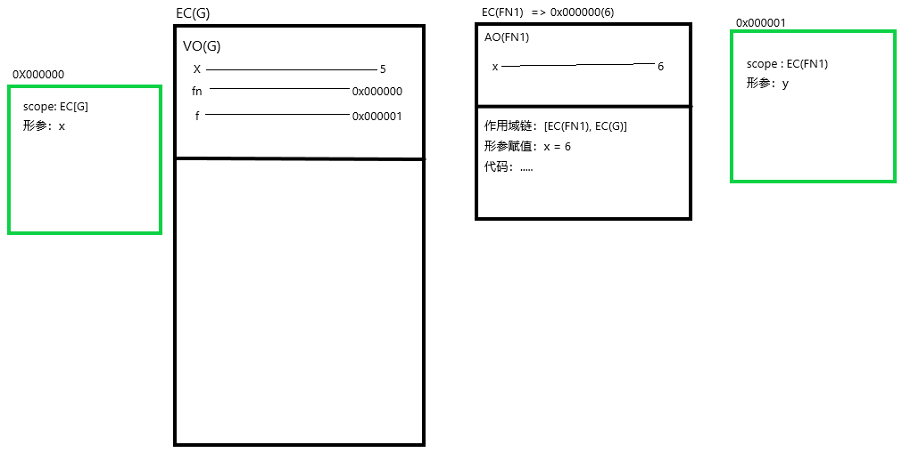
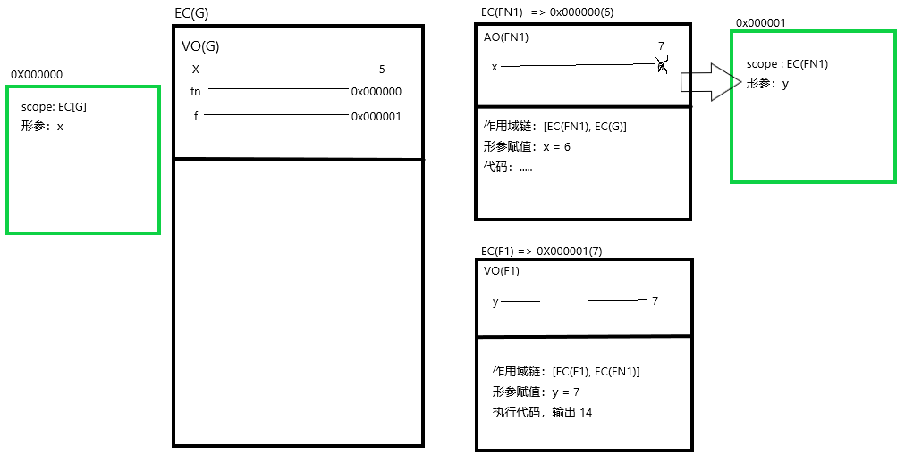
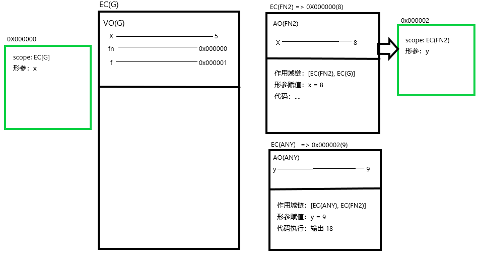
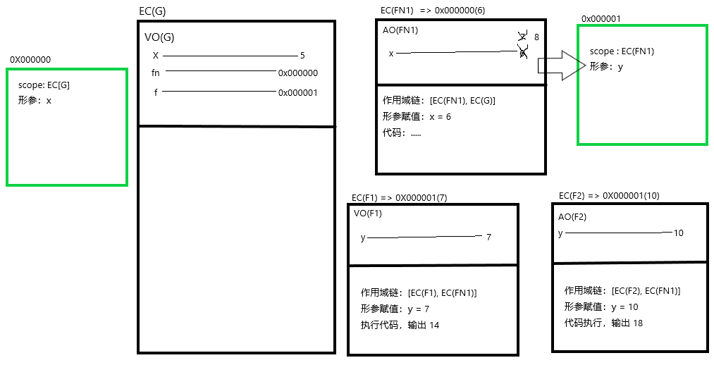

# 从一个例子图解彻底了解闭包机制
```javascript
let x = 5;
function fn(x) {
    return function(y) {
        console.log(y + (++x));
    }
}
let f = fn(6);
f(7);
fn(8)(9);
f(10);
console.log(x);
```

**这里图解省略了执行栈以及进栈执行的过程，同样也省略了初始化 this ，arguments，和变量提升的过程！！！**

首先，如之前笔记所述，浏览器会先放置值，在定义变量，再将两者关联起来。对于变量 x，fn，浏览器直接定义。对于变量 f，将`fn(6)`执行结果关联到 f，如下图：


接下来，`f(7);` 令函数执行，新的私有上下文被创建，如下图：


`fn(8)(9);`，如上图所示，fn f 两个变量关联两个不同的堆内存，所以 fn 执行与 f 变量无关系。fn 执行形成新的上下文EC(FN2)，如图所示：


最后，`f(10)` 执行应执行变量 f 所关联函数，即 0x000001，结果如图：


`console.log(x)`，全局变量里最开始定义了 x，所以最后打印的也是全局变量 x 所关联的值（5）

**闭包相关问题，一般如上画图都可以很清晰的解决，多画图慢慢熟练了就很快的可以看出结果。**
