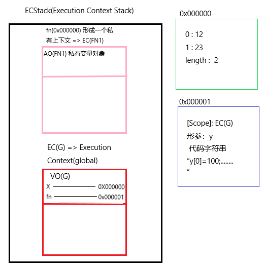
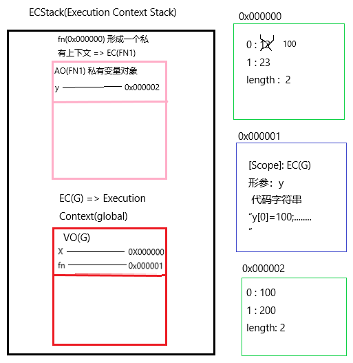

# 函数的底层处理机制


### 创建一个函数和创建一个变量类似：
+ 都是声明一个变量储存值
+ 函数函数名（也算是变量）
+ 创建一个函数也是开辟一个新的**堆内存**
    + 对象的堆内存中，存储的是它的键值对
    + 函数的堆内存中，存储的是它的代码，以**字符串**的形式存储
    + 创建函数的时候就声明了它的**作用域（scope）** => 值是当前创建函数时所处的上下文
    + 在哪个上下文中创建的，作用域就是谁
    + 形成 AO(FN1) => Active Object 私有变量对象


### 函数执行的步骤
1. 形成一个私有的上下文（AO）=> 存储当前上下文中声明的变量，然后进栈执行
2. 代码执行之前：
    + 初始化作用域链（scope chain）=> <当前自己的私有上下文， 函数的作用域（创建函数所在的上下文）>
    + 初始化 this
    + 初始化 arguments
    + 形参赋值：在当前上下文中声明一个形参变量，并且把传递的实参值给它
    + 变量提升
3. 代码执行
    + 把之前创建函数，在堆内存中存储的代码字符串拿出来，变为代码一行行的执行
4. 出栈释放

### 私有变量  全局变量：
+ **私有变量** => 私有上下文声明的变量
    + 形参是私有变量
    + 代码执行时候声明的变量
+ **全局变量** => 全局上下文声明的变量
+ 全局变量和私有变量没有直接的关系，可能存在一些间接的关系

### 作用域链查找机制：
+ 私有上下文中代码执行，遇到变量：
    + 如果变量是私有的 => 操作自己的，和外界没必然的关系
    + 如果不是自己私有的 => 基于**作用域链**向其上下文中查找，看是否为上级上下文中私有的，如果也不是，则继续向上查找，直到找到 EC(G)

举个例子：
```javascript
var x = [12, 23];
function fn(y) {
  y[0] = 100;
  y = [100];
  y[1] = 200;
  console.log(y); 
}
fn(x);// [100, 200]
console.log(x);// [100, 23]
```

当 fn 被声明时：



此后，`fn(x);` 使函数执行：



因此，输出结果很清晰的可以看出来。


### 当函数参数默认赋值时，参数会开辟一个自己的参数作用域！！！