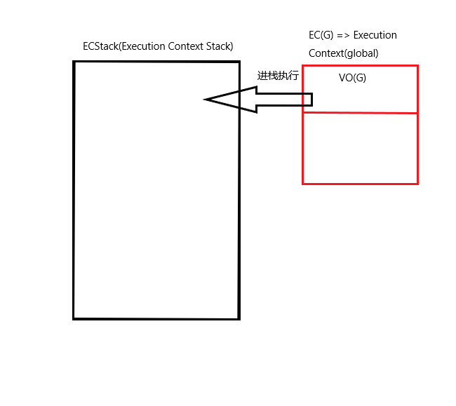
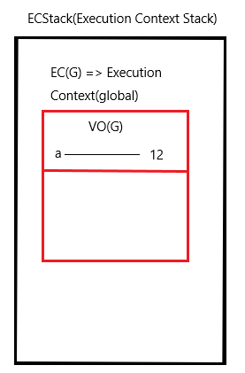
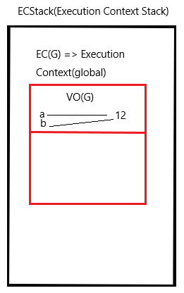
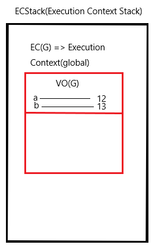
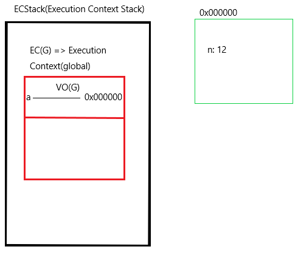
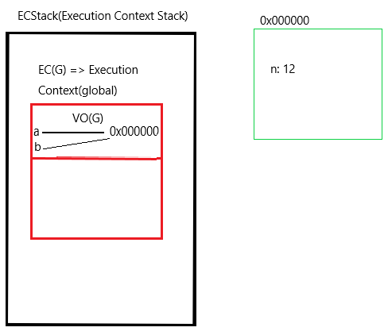

# 浏览器运行机制
## 浏览器底层运行机制
1. 浏览器会在计算机的内存中（内存条）分配出一块内存，用来供代码执行的**栈内存**（Stack）=> ECStack(Execution Context Stack) **执行环境栈**
2. 为了区分是哪个区域（全局或者函数等）下的代码执行，会产生一个**执行上下文** EC(G) => Execution Context(global) **全局执行上下文** 运行时**进栈**运行
    + 全局上下文 EC(G)
    + 函数执行，会形成全新的私有上下文
    + 块级私有上下文
    + ...
3. 在 EC(G) 中，会有 VO(G) => Variable Object 存储当前上下文声明的变量

## 声明变量时的运行机制
`var [variable] = [value]`
1. 先创建值 [value]
    + 基本类型值，**直接存储在栈内存中**
    + 引用类型值，单独开辟一个单独的内存空间（**堆内存**）
2. 声明变量 declare variable
    + 存放到当前上下文的**变量对象**中（**VO/AO**）
3. 变量和值关联到一起 define

来看一个例子：
```javascript
var a = 12;
var b = a;
b = 13;
console.log(a);
```

首先，如下图所示，浏览器会开辟一个栈内存和执行上下文，代码运行时，上下文会进栈执行


接下来，对于`var a = 12;`, 先在栈内存中储存 12 这个值，然后在上下文中声明 a,并将两者关联，如下图



然后，对于`var b = a;`, a 是已经声明的变量，并且已经被定义，所以将 b 直接关联到 a 关联的值，如下图



之后，`b = 13`, 13 要先存储在堆内存中，再将 b 和 13 关联起来，如下图



最后，执行 `console.log(a)`, a 应为 12

把变量比作丈夫，值比作妻子，那栈里严格执行‘一妻多夫’制度，**一个变量只能关联一个值，一个值可以关联多个变量**


## 创建引用数据类型值
1. 在计算机内存中分配一个单独的内存出来 => **堆内存（HEAP）**
2. 有一个 16 进制的地址 比如：0x000000
3. 把对象中的键值对分别储存到堆内存中
4. 把堆内存的地址放到栈中，供变量使用

来看一个例子：

```javascript
var a = {
  n: 12
};
var b = a;
b['n'] = 13;
console.log(a.n)// => 13
```

不同于之前的基本数据类型，引用数据类型要开辟堆内存：


与之前类似，b 依旧关联到 a 关联的值：


所以，此时修改 b，就是在修改储存在 0x000000 这个堆内存里的对象，最后 `a.n = 13`

另一个例子：
```javascript
var a = {
  n: 12
};
var b = a;
b = {
  n: 13
}
console.log(a.n)// => 12
```
b 关联到 a 的地址后，定义一个新的对象，开辟一个新的堆内存，不改变 a 关联地址的值

## 全局对象 GO global object
存放浏览器供 JS 调用的属性和方法

+ setTimeout
+ setInterval
+ ...

相当于在全局变量对象 VO(G) 里放一个 window

## 运算顺序处理
```javascript
var a = b = 13;
//等于
b = 13;
var a = b;
```
正常计算都是从右到左处理，第一步仍然是创建值

```javascript
a.x = b = 13;
b = a.x = 13;
// 都要先计算 a.x  成员访问优先级仅次于 （） 运算
```
```javascript
var a = {n: 1};
var b = a;
a.x = a = {n: 2};
console.log(a.x); // undefined
console.log(b); // {n: 1, x: {n: 2}}
```
