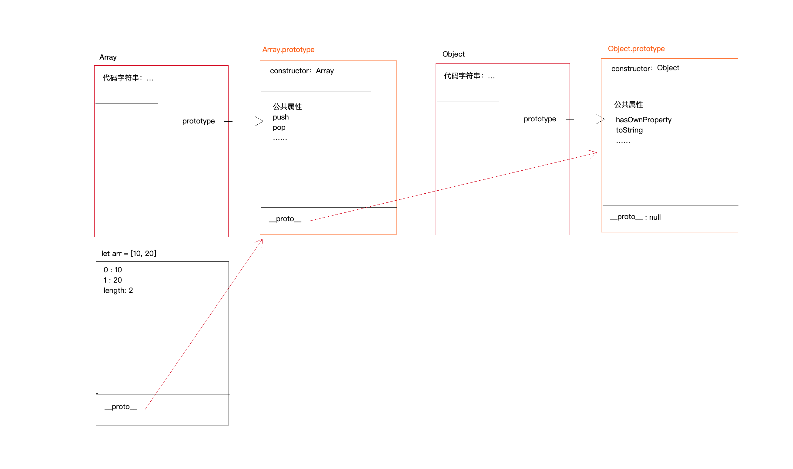

# JS 中的原型和原型链

+ 函数数据类型
    + 普通函数
    + 箭头函数
    + 生成器函数
    + 构造函数
+ 对象数据类型
    + 普通对象/数组对象/正则对象
    + 实例也是对象数据类型（除7种基本类型以外）
    + prototype/__proto__原型属性值也是对象

+ 大部分函数（重点是**构造函数**）都内置一个 prototype（原型）（显式原型）的属性，属性值是一个对象，对象中存储属性和方法供当前类的实例调用的公共属性和方法。
    + 箭头函数没有 prototype
    + 原型对象上有一个内置属性 constructor (构造器)，属性值是当前函数本身。
+ 每一个对象都内置一个 __proto__（原型链）（隐式原型）的属性，属性值指向自己所属类的原型 prototype
  
举个例子，当我们定义一个变量为数组的时候，原型链指向如图所示：


1. 每一个数组都是 Array 的实例，所以每个数组 __proto__ 一定指向 Array.prototype
2. 每一个对象都是 Object 的实例，所以 Array.prototype 中的 __proto__ 指向 Object.prototype

## 原型链的查找机制
1. 先查找当前实例对象中的私有属性，私有中有，获取的就是私有的
2. 私有中没有，默认基于 __proto__ 向上查找
3. 若还找不到，继续向上查找，直到找到 Object.prototype 为止

## 重写 new 面试题
```javascript
function Dog(name) {
    this.name = name;
}
Dog.prototype.bark = function () {
    console.log('wangwang');
}
Dog.prototype.sayName = function () {
    console.log('my name is ' + this.name);
}
/*
let sanmao = new Dog('三毛');
sanmao.sayName();
sanmao.bark();
*/
function _new() {
    //=>完成你的代码 实现如下
    // 1. 创建一个实例对象
    let obj = {};
    obj.__proto__ = ctor.prototype;
    // 2. 函数执行，this 指向实例对象
    let result = ctor.call(obj, ...params);
    // 3. 观察返回值
    if (typeof result === 'object' || typeof result === 'function') {
        return result
    }
    return obj;
}
let sanmao = _new(Dog, '三毛');
sanmao.bark(); //=>"wangwang"
sanmao.sayName(); //=>"my name is 三毛"
console.log(sanmao instanceof Dog); //=>true
```

## 函数多种角色
1. JS 中万物皆对象，函数可以被当作对象
2. 对象是 Function 的一个实例 => `Function.prototype === Object.__proto__
` 成立
3. 所有的 prototype 都是对象 （Function.prototype 是函数）
```javascript
function Foo() {
    getName = function () {
        console.log(1);
    };
    return this;
}
Foo.getName = function () {
    console.log(2);
};
Foo.prototype.getName = function () {
    console.log(3);
};
var getName = function () {
    console.log(4);
};
function getName() {
    console.log(5);
}
Foo.getName();
getName();
Foo().getName();
getName();
new Foo.getName();
new Foo().getName();
new new Foo().getName();
```

## Number 原型链
1. Number 调用 Number.prototype 上的方法时候，浏览器先把 Number 转为对象形式，再调用方法
```javascript
let a = new Number(2);
console.log(a) // => Number {2}
```
```javascript
// 实现如下效果
//solution
Number.prototype.plus = function plus(val) {
    return this + val;
}
Number.prototype.minus = function minus(val) {
    return this - val;
}

let n = 10;
let m = n.plus(10).minus(5);
console.log(m);//=>15（10+10-5）

```